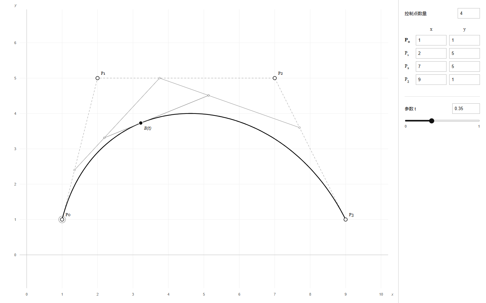

# 贝塞尔曲线生成器

《计算机辅助几何设计》作业，黑白简洁版。双击 `index.html` 即可运行，无需安装或联网。

## 使用

- 侧边输入控制点数量，范围为 2–32；增加时在序列末尾添加点，减少时移除末尾的点。
- 修改每个控制点的 x、y 坐标，按 Enter 或离开输入框后生效；也可直接拖动画布上的控制点。
- 输入参数 t，或拖动滑块，查看对应的 de Casteljau 构造过程。参数范围为 [0,1]。
- 黑色曲线是贝塞尔曲线，灰色虚线是控制多边形，灰色细线是中间插值层，实心点 B(t) 是构造结果。

控制点与参数自动保存在当前浏览器本机；浏览器限制本地存储时仍可使用。控制点通常不全部位于曲线上，曲线经过首尾两点。

## 算法

令初始控制点为 $P_i^{(0)}=P_i$，逐层计算

$$
P_i^{(r)}=(1-t)P_i^{(r-1)}+tP_{i+1}^{(r-1)},
\qquad B(t)=P_0^{(n)}.
$$

n+1 个控制点定义一条 n 次贝塞尔曲线。数学模块位于 `src/bezier.js`，界面与绘制位于 `src/app.js`，样式位于 `styles.css`。

画布按相同的横纵坐标单位绘制；修改点数、输入坐标或改变窗口尺寸时自动调整显示范围。拖动坐标保留三位小数，计算使用浮点数，曲线以采样折线显示。

## 开发与上传

安装 Node.js 18 或更新版本后，可运行 `npm test` 检查数学算法，或运行 `npm start` 启动本地预览服务。不需要安装第三方依赖。

上传 GitHub 时将本文件夹内容放到仓库根目录。若需网页展示，可在仓库 Settings → Pages 中选择 Deploy from a branch，再选择对应分支和 /(root)。
